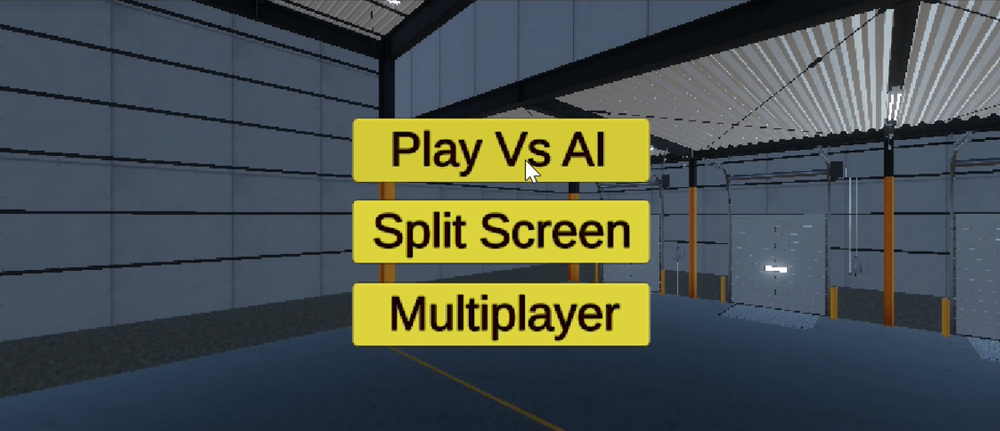
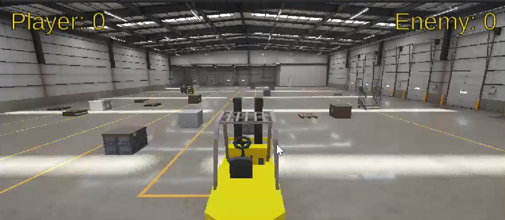
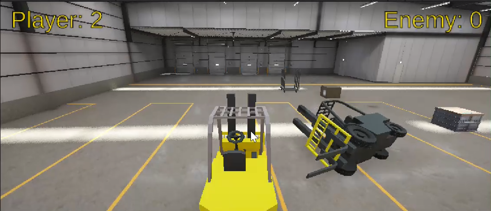
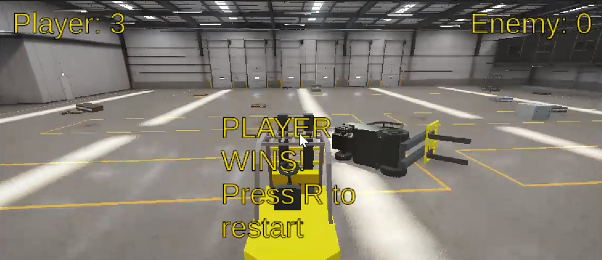
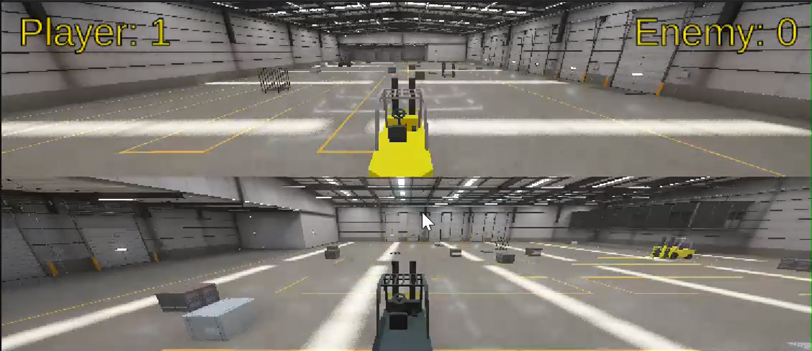

# 🏗️ Forklift Jousting

A 3D Unity game where two forklifts battle in a factory arena. Score points by flipping the opponent's forklift in this physics-based, procedurally enhanced showdown.

## 🎮 Gameplay Overview

- Two forklifts (Player vs. AI or Player vs. Player).
- Earn a point by flipping your opponent.
- First to 3 points wins.
- Items spawn randomly each round to change the environment.

## ✅ Features

- **🧠 AI Opponent**: The enemy forklift uses pathfinding to chase and attack.
- **🔁 Procedural Generation**: Obstacles spawn in new positions every round.
- **📊 Scoring System**: Tracks and displays player and enemy scores.
- **🎯 Win/Lose Conditions**: Game ends when a player reaches 3 points.
- **🔊 Sound Effects**: Background noise and forklift horn.
- **🧭 Reset System**: Forklifts and obstacles reset after each round.
- **🎮 Split-screen Ready**: Can be expanded for multiplayer input.

## 🛠️ Controls

| Action              | Key            |
|---------------------|----------------|
| Move (Player 1)     | Arrow Keys     |
| Forklift Horn       | Spacebar       |
| Restart Game        | R              |
| Pause to Main Menu  | Escape         |

*Player 2 (or AI) uses different input or scripted control.*

## 🧪 Tech Stack

- **Engine**: Unity 2022+
- **Language**: C#
- **UI**: TextMeshPro
- **Physics**: Unity Rigidbody, WheelCollider
- **AI**: Basic player-targeting and pursuit behavior using Rigidbody movement and rotation

## 📸 Screenshots

## 🎨 Asset Credits

- **Forklift Model** – from [Unity Asset Store](https://assetstore.unity.com/packages/3d/vehicles/controllable-forklift-free-80275) by IKupreev (Standard Unity Asset Store EULA)
- **Factory Environment and Objects** – from [Unity Asset Store](https://assetstore.unity.com/packages/3d/environments/industrial/unity-warehouse-276394) by Unity Technologies Japan (Standard Unity Asset Store EULA)
- **Music** – from [Unity Asset Store](https://assetstore.unity.com/packages/audio/music/casual-game-bgm-5-135943) by B.G.M. (Standard Unity Asset Store EULA)

- **Sound Effects** – from [Unity Asset Store](https://assetstore.unity.com/packages/audio/sound-fx/engines-123836) by Kristian Grundstrom (Standard Unity Asset Store EULA)

## 📃 License

This project is for educational/demo use only. Not for commercial distribution.